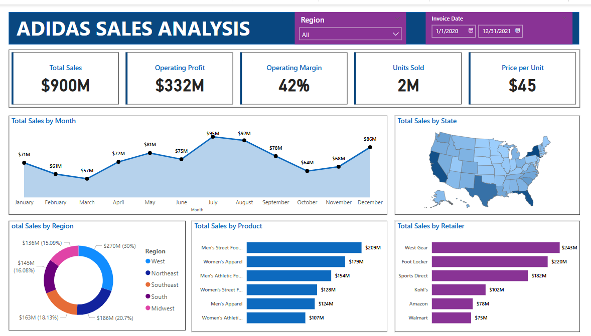

# 👟 Adidas Sales Analysis Dashboard – Power BI Project

This project presents a comprehensive **Adidas Sales Analysis Dashboard** built in **Power BI**, aimed at providing key business insights across product categories, regions, and performance indicators to help drive data-informed decisions.

---

## 🖼️ Dashboard Preview

  

---

## 📌 Project Objective

The objective of this project is to help Adidas analyze their sales performance across multiple states, retailers, and product categories. The dashboard offers an executive-level view of:

- Overall sales performance
- Profitability by region and category
- Sales trends over time
- Top-performing products and retailers

---

## 🔍 Key Features

- 📊 **Dynamic visualizations**: bar charts, KPIs, maps, and trend lines
- 🌍 **Geo analysis** using shape maps for region-wise sales
- 📈 **Time-series analysis** for monthly performance
- 🧮 **Calculated measures** using DAX (e.g., profit margin, total sales, YoY growth)
- 🎯 **Interactive filters** for State, Retailer, Product Type, etc.

---

## 🧹 Data Source & Preparation

- 📄 **Dataset**: Adidas sales data containing:
  - `Retailer`, `Product`, `State`, `Units Sold`, `Revenue`, `COGS`, `Profit`, `Order Date`
- 🧼 **Data Cleaning**:
  - Removed duplicates and nulls using **Power Query**
  - Added calculated columns for `Profit Margin`, `Year`, `Month`
- 🧠 **Data Model**: Star schema with measures and dimensions

---

## 🛠 Tools & Technologies

- **Power BI Desktop**
- **Power Query** (ETL)
- **DAX** (KPIs, Measures)
- **Excel/CSV** (Data Source)
- **Shape Maps** (Geo visuals)

---

## 📈 Skills Demonstrated

- Business Intelligence & Dashboarding  
- Data Cleaning and Transformation  
- DAX for calculated measures  
- Storytelling with data  
- Data Modeling and Relationship Management  

---

